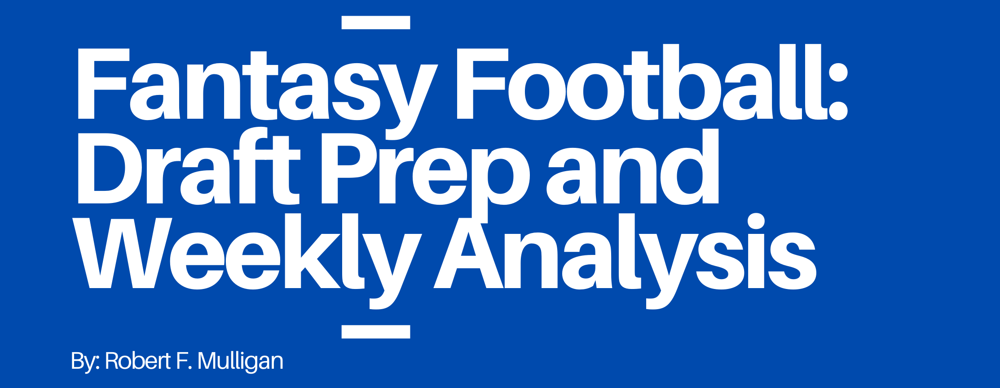

<p align="center">
<a href="https://github.com/robert-f-mulligan/fantasy-football/commits/master" target="_blank">
    
  </a>
</p>
<p align="center">
<a href="https://www.linkedin.com/in/robertfmulligan/" target="_blank">
    
    </a>
<a href="https://www.twitter.com/mulliganrob" target="_blank">
    
    </a>
</p>

## Table of Contents
------------

- [Introduction](#introduction)
- [Project Organization](#project-organization)
- [Installation](#installation)
    - [Config](#config)
    - [Selenium](#selenium)
    - [NLTK Add On](#nltk-add-on)
- [Web Scraping](#web-scraping)
- [In Season](#in-season)
    - [Visualizations](#visualizations)
        - [Head to Head](#head-to-head)
        - [Kernel Density Estimation](#kernel-denisty-estimation)
        - [Heat Map](#heat-map)
        - [Scatterplots](#scatterplots)
        - [Heat Maps](#heat-maps)
        - [Bar Charts](#bar-charts)
- [Draft Prep](#draft-prep)
- [Twitter Sentiment Analysis](#twitter-sentiment-analysis)
- [Tiers](#tiers)
    - [Sample Tier Plot](#sample-tier-plot)

## Introduction
------------

This package is designed to give season-long fantasy football players a way to ceate an edge by using `python` as a tool to:
- Draft using a systematic, value-based model
- Scrape data to ensure accurate and up-to-date information
- Quantify weekly performance and uncover hidden productivity using advanced metrics
- Use data visualization to easily spot both player and team trends and relationships 
- Apply clustering algoritms to players to reveal natural tiers among players


[(Back to top)](#table-of-contents)


## Project Organization

------------

    │
    ├── data/                <- The original, immutable data dump. 
    │
    ├── notebooks/           <- Jupyter notebooks. 
    │
    ├── tests/               <- Unit tests.
    │
    ├── fantasyfootball/     <- Python module with source code of this project.
    │
    ├── figures/             <- Charts and sample visualizations.
    │
    ├── LICENSE
    │
    ├── requirements.txt     <- pip package dependencies.   
    │
    ├── README.md            <- Project summary and instructions.
    │
    └── setup.py             <- run this to install source code.
    


[(Back to top)](#table-of-contents)

## Installation

------------

Clone this repo locally:

```sh
$ git init
$ git clone https://github.com/Robert-F-Mulligan/fantasy-football.git
```

Install the virtual environment:

```sh
$ python -m venv /path/to/new/virtual/environment
```
Activate virtual environment:
```sh
$ cd /path/to/new/virtual/environment/Scripts/activate 
```

Navigate to the cloned directory and install fantasyfootball in the virtual environment by running setup.py:

```sh
$ cd /path/to/cloned/repo
$ pip install -e .
```

Install project dependencies through pip and requirements.txt:

```sh
$ pip install -r requrements.txt
```

Install a new ipython kernel:

```sh
$ ipython kernel install --user --name=fantasyfootball
```

To run Jupyter Notebook and open the notebooks in `.notebooks/`:

```sh
$ jupyter notebook
```
Select the new kernel fantasyfootball

[(Back to top)](#table-of-contents)

### Config
------------
In order for this package to be truly customizable, you should add a `dict` to config.py that includes league specific information and then use this dict for any function that requires a `league` argument:

```python
my_league = {
    'name' : 'ppr', # name of league
    'team_n' : 12, # teams in league
    'scoring' : 'ppr', # scoring type - 'ppr', 'half-ppr' or 'standard'
    'rounds' : 13, # draft rounds, not including kickers or DST
    'passing_yds' : 0.04, # passing yards scoring
    'passing_td' : 6, # passing TD scoring
    'passing_int' : -1, # passing int scoring
    'rushing_yds' : 0.1, # rushing yd scoring
    'rushing_td' : 6, # rushing TD scoring
    'receiving_rec' : 1, # reception scoring
    'receiving_yds' : 0.1, # receiving yd scoring
    'receiving_td' : 6, # receiving TD scoring
    'fumbles' : -1, # fumble scoring
    'fumbles_lost' : -2, # fumbles lost scoring
    'qb' : 1, # number of QBs in a starting lineup
    'rb' : 2, # number of RBs in a starting lineup
    'wr' : 2, # number of WRs in a starting lineup
    'te' : 1, # number of TEs in a starting lineup
    'flex' : 1, # number of FLEXs in a starting lineup
    'dst' : 1, # number of DSTs in a starting lineup
    'k' : 1 # number of Ks in a starting lineup
}
```
The `config.py` file also contains other reference information and general use functionality:
- Color mapping for NFL teams for data visualization
- Image mapping for NFL main logos and wordmarks
- Fantasy point calculators for different `.py` files

[(Back to top)](#table-of-contents)

### Selenium
------------
Due to a change in the FantasyPros website, you can no longer scrape  simple tables with `BeautifulSoup` for ECR (expert consensus rankings) and stat projections. However it is still possible to pull the data by using using `selenium`, whichs allows the scraping and parsing of dynamic javascript webpages.

Scraping with `selenium` requires the following downloads:
- [Chrome](https://www.google.com/chrome/)
- [Chromedriver](https://sites.google.com/a/chromium.org/chromedriver/downloads)
    - Once downloaded, save the driver on your machine and update the `DRIVER_PATH` in the `config.py` file

[(Back to top)](#table-of-contents)

### NLTK Add On
------------
In order to run a Twitter sentiment analysis, you must install 'vader_lexicon'
Using Windows Terminal (in addition to installing the main package via `requirements.txt`):
```python
$ python
>>> import nltk
>>> nltk.download('vader_lexicon')
```

[(Back to top)](#table-of-contents)

## Web Scraping
------------
We can access various fantasy football data for the purposes of further analysis by scraping information from the internet. This is accomplished primarily through `BeautifulSoup`, with the exception of `fantasypros.py`, which requires `selenium`. Data is transformed through the `pandas` module. Currently, the following scrapers are functional:
- [Fantasy Pros - ECR and stat projections](.\fantasyfootball\fantasypros.py/)
    - Used exclusively by other scripts and for analysis in a notebook
    - Used for draft prep; allows the combination of consensus rankings and projections in order to build a value-based drafting methodology
    - Also used for in-season tier modelling
- [Pro Football Reference - Game by Game](.\fantasyfootball\pfrgbg.py)
    - Run on the command line `python pfrgbg.py` or import in a notebook for analysis
    - Used for deriving previous season's fantasy performance metrics
- [Pro Football Reference - Year by Year](.\fantasyfootball\pfryby.py)
    - Run on the command line `python pfryby.py` or import in a notebook for analysis
    - Used for historical analysis
- [Pro Football Reference - Advanced Stats](.\fantasyfootball\pfradv.py)
    - Run on the command line `python pfradv.py` or import in a notebook for analysis
- [FF Calculator - ADP Data](.\fantasyfootball\ffcalculator.py)
    - Run on the command line `python ffcalculator.py` or import in a notebook for analysis
    - Used for importing up-to-date average draft position (ADP) data for a given league size and format
- [nflfastR Github Repo - Play by Play Data](.\fantasyfootball\nflfastr.py)
    - Used exclusively by other scripts and for analysis in a notebook
    - Primarily used for in-season, week-by-week analysis
    - Used extensively for visualizations
    - Original repo is [found here](https://github.com/guga31bb/nflfastR-data)

[(Back to top)](#table-of-contents)

## In Season
------------

In season data is scraped primarily through the `nflfastR` github repo. Further documentation can be found [here](https://www.rdocumentation.org/packages/nflscrapR/versions/1.8.1/topics/scrape_json_play_by_play).

In season visualizations can be updated all at once by running all of the cells in the [NFL-Weekly-Vizzes.ipynb](\notebooks\NFL-Weekly-Vizzes.ipynb) file.

### Visualizations
Visualizations usually have a related `transform` function in order to shape the data correctly for either `matplotlib` or `seaborn`. 

#### Head to Head

THe purpose of `nflteamh2h.py` is to compare NFL teams against eachother to spot how they match up along several important metrics. Fantasy points per game by position is scraped from [FF Today](https://fftoday.com), the rest of the metrics are derived from `nflfastR`.


#### Kernel Density Estimation
This chart is depicting air yard distribution (specifically the probability of being targeted for a specific air yard amount via a continuous curve). Data is sourced from `nflfastR`. This plot relies on `seaborn`'s `kdeplot()` function. 


#### Heat Map

This table shows various fantasy football specific measures of productivity. There is also related chart geared towards WR's and QB's. This chart is relying on `pandas` and `styler` functionality. Data is sourced from `nflfastR`.


#### Scatterplots
Scatter plots are created through `matplotlib`. The drawing function is meant to be flexibile - you can pass any two metrics to visualize the relationship between two variables. Data is sourced from `nflfastR`.


#### Bar Charts
Bar charts are also created through `matplotlib`. Data is sourced from `nflfastR`.


[(Back to top)](#table-of-contents)

## Draft Prep
------------
The main file to run is `draft.py`. This script is designed to tailor draft strategy by league-specific rules. It will take into account point values, league size, and format (i.e. PPR).

In order for the file to run correctly, set the following parameters in the file before running:

```python
pos_tier_dict_viz = {
    'RB' : 8,
    'QB' : 7,
    'WR' : 8,
    'TE' : 5,
    'DST' : 5,
    'K' : 4
    } # pass a dict of the number of tiers you wish to pass to the clustering algorithm; this is set by running AIC/BIC or Elbow chart in tiers.py

league = # pass your league dict here
weekly_stats_year = # set previous season year here
weekly_path = # set the path to weekly data of the previous season 
replacement_method = # pick the value-over-replacement methodology
```

- Four main sources of data:
    - Fantasy Pros stat projections
    - Fantasy Pros ECR rankings
    - FF Calculator ADP
    - Pro Football Reference Previous Season Weekly Data
        - For average points and standard deviation

- VOR Calculation
    - Position specific methodology
        - 'avg starter' : replacement value for an avg starter
        - 'top n' : position specific cut-off
        - 'replacement player' : player who should be available on waivers
        - 'last starter' : value for a low-end starter

[(Back to top)](#table-of-contents)

## Twitter Sentiment Analysis
------------
The purpose of `twitter.py` is to analyize the text contained in tweets on Twitter to rate each by how positively/negatively the discussion is for a given player. This may allow the capturing of news or expert information that hasn't been made widely available at the time of the analysis. 

You will need to sign up for the [Twitter API](https://developer.twitter.com/en/apply-for-access) and set the following variables in a ```.env``` file in the root directory:
- TWITTER_ACCESS_TOKEN
- TWITTER_ACCESS_TOKEN_SECRET
- TWITTER_CONSUMER_KEY
- TWITTER_CONSUMER_KEY_SECRET

For further customization, add the Twitter accounts you wish to include for analysis in the `twitterconfig.py` file.

```python
ANALYSTS = {
        'Matthew Berry': 'MatthewBerryTMR', # account name : twitter account
        'Field Yates': 'FieldYates',
        'NFL Fantasy Football': 'NFLFantasy',
        'PFF Fantasy Football': 'PFF_Fantasy',
        'FantasyPros': 'FantasyPros'
}
```

The list of players is generated from `ffcalculator.py`. 

[(Back to top)](#table-of-contents)

## Tiers
------------
`tier.py ` and `tiersweekly.py` are files used to harness a clustering algorithm to determine natural breaks in rankings based on Fantasy Pros ECR data, with the goal of being able to make drafting and weekly line-ups easier by allowing groupings of similar players. 
- Tiers are determined by default by the following variables:
    - average ranking
    - highest ranking among experts
    - lowest ranking among experts
- Kmeans
    - Cluster hyperparameter can be determined by running:
    ```python
    def kmeans_sse_chart()
    ```
    - Optimal number of clusters will be where the "elbow" flattens out
    - Does poorly with odd shape clusters
    - Can run quickly with higher-dimensional data
- Gaussian Mixture Model
    - hyperparameter can be determined by running:
    ```python
    def def gmm_component_silhouette_estimator()
    ```
    - Optimal number of clusters will be where the Akaike's Information Criterion (AIC) and/or Bayesian Information Criterion (BIC) is minimzied
    - Can recongnize different or oddly shaped clusters
    - Probabilistic model
    - Runs optimally with lower-dimensional data

In short, choose the method that fits your data.

### Sample Tier Plot


[(Back to top)](#table-of-contents)